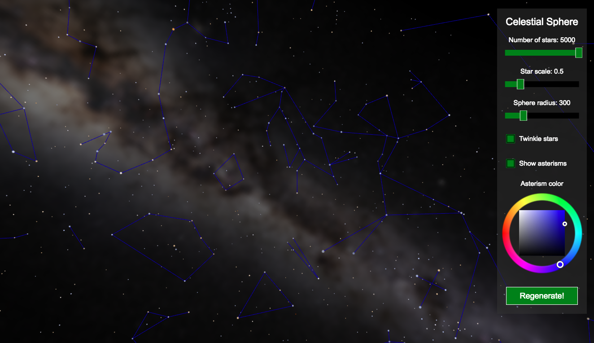

# Babylon.js Celestial Sphere
Dynamically generates a celestial sphere based on real star map data of the 5000 brightest stars (about the maximum visible to the naked eye from Earth under ideal conditions). The data (right ascension, declination, color, magnitude etc) is a subset of the Tycho-2 Catalogue. This provides more crispness, performance and control over how the stars are rendered (relative scale, brightness, color enhancement, blending with other skyboxes, star "twinkle" effect, constellation lines etc) than using static skybox images.

## Screenshot

